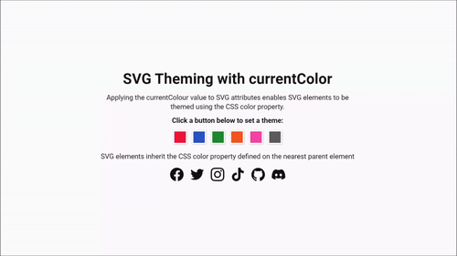

# SVG Theming with currentColor
This project demonstrates how the currentColor value can be applied to SVG attributes allowing SVG elements to inherit the CSS color property defined on the nearest parent element.

## Live Demo
A live demo is available on [CodePen](https://cdpn.io/abGmrmr) and [Netlify](https://svg-theming-currentcolor.netlify.com/).

## License
This project is licensed under the MIT License - see the [license.md](license.md) file for details.